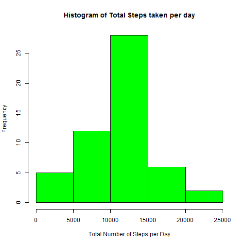
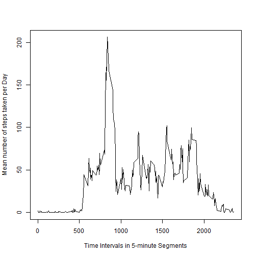

This assignment makes use of data from a personal activity monitoring device. This device collects data at 5 minute intervals through out the day. The data consists of two months of data from an anonymous individual collected during the months of October and November, 2012 and include the number of steps taken in 5 minute intervals each day.  The first thing we need to do is download the data file, unzip it, and load it into R. 

The URL for the file is: https://d396qusza40orc.cloudfront.net/repdata%2Fdata%2Factivity.zip

Please download, unpack, and save in your working directory.  

List of required packages:


```r
require(dplyr)
require(lattice)
```


## Loading and preprocessing the data
Let's load the data and tidy it up. In this case, I want to put the date/time on the left side.


```r
## Load and tidy the data
unzip("activity.zip")
rawdata <- read.csv("activity.csv",sep=",",header=TRUE)        
Days<-group_by(rawdata,date)
data<-summarise(Days,Total=sum(steps,na.omit=TRUE))
```

## What is mean total number of steps taken per day?
Make a histogram of the total number of steps taken each day


```r
hist(data$Total, xlab="Total Number of Steps per Day", ylab="Frequency", main="Histogram of Total Steps taken per day", col="green")
```

 

Calculate the mean and median of steps taken per day


```r
Mean<-mean(data$Total,na.rm=TRUE)
Median<-median(data$Total,na.rm=TRUE)
```

The mean number of steps taken per day was: 1.0767189 &times; 10<sup>4</sup> steps.
The median number of steps taken per day was 10766 steps.


## What is the average daily activity pattern?
This section calculated the pattern of activity inside a day, based on the 5 minute intervals of data collected.


```r
Int<-group_by(rawdata,interval)
Intervals<-summarise(Int,Average=mean(steps,na.rm=TRUE))
plot(Intervals$interval,Intervals$Average, type = "l", xlab = "Time Intervals in 5-minute Segments", ylab = "Mean number of steps taken per Day" )
```

 

```r
MaxInterval<-Intervals[which.max(Intervals$Average),1]
```

The maximum 5-minute interval accross all the days in the dataset is the 835 Interval.

## Imputing missing values
For this section, the NAs are removed from the dataset and replaced with the 5minute internval average from the overall dataset.  


```r
naData<-sum(is.na(rawdata))
```

The total number of rows with NA data is: 2304.


```r
modData<-rawdata
count<-0
for (i in 1:nrow(modData) ) {
        if (is.na(modData[i,1])) {
                modData[i,1]<-Intervals$Average[i]
                count=count+1
        }   
}
```

The total number of rows modified is 2304.  This matches the number of rows in which NA was found.


```r
Days2<-group_by(modData,date)
data2<-summarise(Days2,Total=sum(steps,na.omit=TRUE))
hist(data2$Total, xlab="Total Number of Steps per Day", ylab="Frequency", main="Histogram of Total Steps taken per day with Modified Data", col="red")
```

 

```r
Mean2<-mean(data2$Total,na.rm=TRUE)
Median2<-median(data2$Total,na.rm=TRUE)
```

The raw data had a mean of 1.0767189 &times; 10<sup>4</sup>, after the NA's were replaced with the average of that interval, the new mean is 1.0767189 &times; 10<sup>4</sup>.

The raw data had a median of 10766, after the NA's were replaced with the average of that interval, the new median is 1.0766594 &times; 10<sup>4</sup>.

These show very little difference because we were using the 5-minute interval averages to fill in the NA's.  This is not surprising that using the averages would not change the overall mean and median.


## Are there differences in activity patterns between weekdays and weekends?
Last part of the assignment, using the modified data, see if there is a difference between weekdays and weekends.  The question asks that we use levels, therefore we have to use the factor comand and week days command.


```r
modData$day = ifelse(as.POSIXlt(as.Date(modData$date))$wday%%6 == 0, "weekend", "weekday")
modData$day = factor(modData$day, levels = c("weekday", "weekend"))
```

The readme file on GitHub suggests we use the lattice graphing system.  Not my first choice, but to make the graph look the same, I'm using it.  


```r
dayOfWeek<-group_by(modData,interval,day)
dayOfWeek<-summarise(dayOfWeek,Average=mean(steps,na.rm=TRUE))
xyplot(Average ~ interval | factor(day), data = dayOfWeek, type = "l",aspect = 1/2) 
```

 


The end, this was a very long assignment, that took me much more than 4 hours.  
